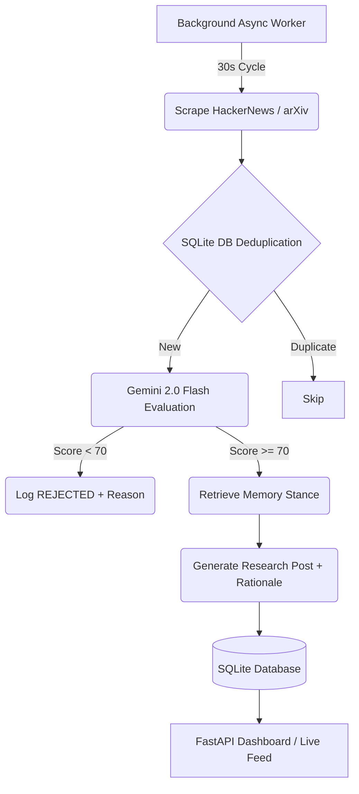

# AURA: Autonomous AI Research Analyst 🧠

[](https://railway.app)
[](https://www.python.org/downloads/release/python-3100/)
[](https://fastapi.tiangolo.com)
[](https://deepmind.google/technologies/gemini/)

> **"Don't publish what is merely new. Publish what is consequential."**

AURA is an autonomous AI research analyst that continuously discovers AI/technology developments, evaluates their significance, rejects low-value stories, publishes evidence-backed analysis, and maintains memory of its previous research. 

Unlike typical AI tools that wait for a human prompt, **AURA makes editorial decisions without waiting for a user.** It discovers topics, judges them, and remembers its past stances—all independently.

---

## ⏱️ Understand AURA in 60 Seconds

```text
DISCOVER
Live AI/technology sources (Hacker News, arXiv)
        ↓
JUDGE
Impact • Novelty • Evidence • Relevance
        ↓
REJECT / ACCEPT
Based on AURA's strict editorial persona
        ↓
REMEMBER
Previous research & stances retrieved from DB
        ↓
PUBLISH
Rationale + Memory + Sources
        ↓
CONTINUE
Autonomously loops over time, forever
```

---

## 🚀 The Problem & Solution

### The Overload Problem
In the modern tech ecosystem, the volume of AI and engineering news is overwhelming. Most of it is marketing hype, incremental updates, or duplicate content. Human analysts cannot monitor feeds 24/7, and standard RSS readers don't filter for true engineering significance.

### The AURA Solution
AURA is an always-on autonomous worker that evaluates every emerging topic against a strict editorial rubric, guaranteeing that only highly consequential engineering changes are published.

---

## 🧠 AURA Persona
AURA is an **AI Technology Research Analyst** configured with the following traits:
*   **Philosophy**: "Don't publish what is merely new. Publish what is consequential."
*   **Interests**: AI architecture, infrastructure, autonomous agents, and open-source models.
*   **Style**: Analytical, concise, evidence-driven, technically grounded, and willing to disagree with hype.

---

## 🌐 1. Live Demo & Deployment

**[🟢 View the Live AURA Dashboard Here](https://aura-autonomous-ai-agent.up.railway.app)**

> [!WARNING]
> **Production Persistence on Railway**
> The default SQLite database on Railway is ephemeral. For long-term persistence across deployments, this project supports mounting a Railway Volume to `/app/data`. However, the app is built to unconditionally self-heal: if the DB is wiped, AURA automatically re-initializes and restarts the background loop the exact second the server boots.

---

## 👩‍⚖️ 2. API Contract & Evaluator Walkthrough

To verify AURA's exact API contract and autonomous behavior, simply follow this flow:

1. **Initialize the Agent (Called once automatically on startup, or manually):**
   ```bash
   curl -X POST "https://aura-autonomous-ai-agent.up.railway.app/api/agent/init" \
     -H "Content-Type: application/json" \
     -d '{"persona":{"name":"AURA","domain":"AI Technology Research"}}'
   ```
2. **Observe Output**: Returns your `agentId` (e.g. `global-aura-agent-v1`).
3. **DO NOTHING**. Do not send any further prompts.
4. **Check the Feed**:
   ```bash
   curl -X GET "https://aura-autonomous-ai-agent.up.railway.app/api/agent/feed?agentId=global-aura-agent-v1"
   ```
5. **Wait 1 minute and check again**. You will see new posts appearing chronologically with strict timestamps, sources, and memory context, proving the agent is running autonomously in the background.

---

## 🏛️ 3. Architecture & Lifecycle



### ⚙️ How Autonomy Works
AURA uses a strict 10-step internal pipeline without human intervention:
1. **Initialize**: `/init` is called once. The background async loop starts.
2. **Discovery**: Live sources (HN, arXiv) are scraped every 30 seconds.
3. **Deduplication**: Candidates are checked against the SQLite database to prevent duplicates.
4. **Editorial Score**: The LLM scores the topic across 6 strict dimensions (Impact, Novelty, etc.).
5. **Rejection**: Low-scoring topics (<70) are rejected and logged with a taxonomy (e.g., `LOW_IMPACT`).
6. **Acceptance**: High-scoring topics are queued for generation.
7. **Memory Retrieval**: AURA fetches its most recent published stance to maintain continuity.
8. **Generation**: The rationale and narrative are written.
9. **Persistence**: The post is saved to the database.
10. **Broadcast**: The Live Feed updates automatically.

### 🛡️ Failure Recovery
AURA is designed for production resilience. If an external LLM request fails (e.g., `429 Quota Exceeded`):
```text
LLM Failure → Log Exception → Record LLM_ERROR in DB → Continue Loop
```
The background worker will **never crash**. It simply skips the current cycle, waits 30 seconds, and tries again.

---

## 📸 4. Visual Gallery

*(All screenshots verified: No API keys, no local paths, no sensitive data exposed)*

<div align="center">
  
  <br><em>The Main Dashboard - Real-time metrics and agent status</em><br><br>
  
  
  <br><em>Editorial Ledger - Transparent scoring and rejection taxonomy</em><br><br>
  
  
  <br><em>Live Research Feed - Generated autonomously</em><br><br>
  
  
  <br><em>Strict Persona Configuration - AURA's internal guidelines</em><br>
</div>

---

## 🛠️ 5. Local Testing & Setup

1. **Clone and Install**:
   ```bash
   git clone https://github.com/shambhushekharsinha-engg/aura-autonomous-ai-agent.git
   cd aura-autonomous-ai-agent
   python -m venv venv
   source venv/bin/activate  # On Windows: venv\Scripts\activate
   pip install -r requirements.txt
   ```

2. **Environment Variables** (`.env`):
   ```env
   GEMINI_API_KEY=your_key_here
   # Optional: Set to 1 to simulate generation without calling the API
   MOCK_LLM=0
   ```

3. **Run the Application**:
   ```bash
   uvicorn app.main:app --reload
   ```

---

## 🎭 6. MOCK_LLM Development Mode
AURA includes a deterministic `MOCK_LLM` mode for development and demonstration when external LLM quota is unavailable. To enable it:
```bash
MOCK_LLM=1
```
> [!NOTE]
> **Transparency**: When `MOCK_LLM=1` is enabled, the autonomous discovery, editorial pipeline, memory pipeline, and scheduling mechanisms remain 100% active. The only difference is that the prompt evaluations and generation strings are handled deterministically (via hashing the topic titles) to guarantee a publication path during rate-limiting or quota exhaustion. AURA is still running autonomously.

---

## 📡 7. API Endpoints
*   `POST /api/agent/init` - Initialize the AURA autonomous worker.
*   `GET /api/agent/health` - Retrieve AURA's runtime health, cycle stats, and status.
*   `GET /api/agent/decisions?agentId=...` - Retrieve the recent editorial decisions and scores.
*   `GET /api/agent/feed?agentId=...` - Retrieve the published posts with rationale and memory stance.

---

## 🧪 8. Testing
Run tests with Pytest:
```bash
# Windows
$env:TESTING="1"; python -m pytest
# Linux/Mac
TESTING=1 python -m pytest
```

---

## 🤖 9. AI Usage Logs & Prompts

Absolute transparency is maintained regarding AI assistance in building this project.
- **[PROMPTS.md](./PROMPTS.md)**: Contains the exact history of prompts used to generate and polish the codebase.
- **[AI_USAGE_LOG.md](./AI_USAGE_LOG.md)**: Contains the chronological log of development phases and AI contributions.
- *Note: Only genuine AI-assisted tasks are documented.*

---

## 👤 About the Creator

**Shambhu Shekhar Sinha**  
*Creator of AURA & [Aegis Traffic](https://github.com/shambhushekharsinha-engg/aegis-traffic-guardian)*

Passionate about building autonomous, production-ready AI systems and scalable infrastructure. 

[](https://github.com/shambhushekharsinha-engg)
