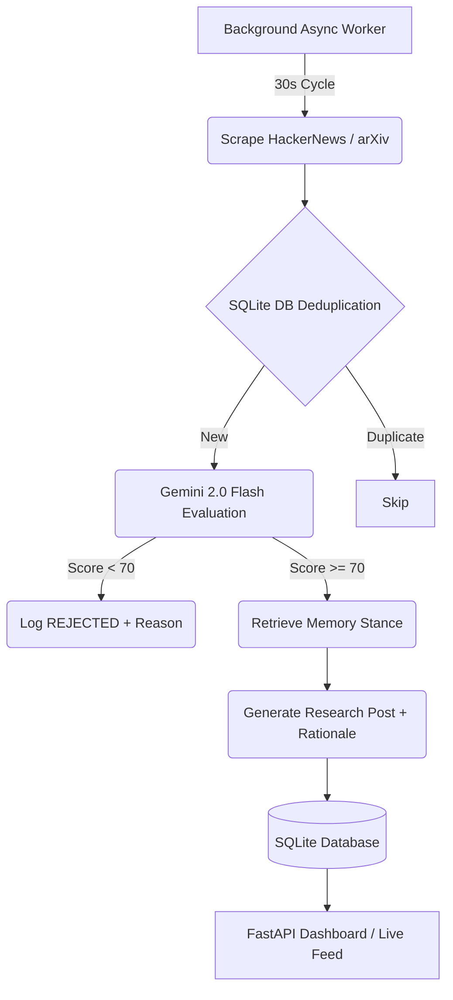

# AURA: Autonomous AI Research Analyst 🧠

[](https://railway.app)
[](https://www.python.org/downloads/release/python-3100/)
[](https://fastapi.tiangolo.com)
[](https://deepmind.google/technologies/gemini/)

> **The Problem:** Every day, thousands of AI-generated posts appear online. Almost all of them exist because a human wrote the first prompt. Today's models are excellent writers, but they are rarely **autonomous creators**. AURA solves this by being a completely independent AI entity that discovers, judges, remembers, and publishes on its own.

---

## ⏱️ Understand AURA in 60 Seconds

```text
DISCOVER
Live AI/technology sources (Hacker News, arXiv)
        ↓
JUDGE
Impact • Novelty • Evidence • Relevance
        ↓
REJECT / ACCEPT
Based on AURA's strict editorial persona
        ↓
REMEMBER
Previous research & stances retrieved from DB
        ↓
PUBLISH
Rationale + Memory + Sources
        ↓
CONTINUE
Autonomously loops over time, forever
```

---

## 🌐 1. Live Demo

**[🟢 View the Live AURA Dashboard Here](https://aura-autonomous-ai-agent.up.railway.app)**

> [!WARNING]
> **Production Persistence on Railway**
> The default SQLite database on Railway is ephemeral. For long-term persistence across deployments, this project supports mounting a Railway Volume to `/app/data`. However, the app is built to unconditionally self-heal: if the DB is wiped, AURA automatically re-initializes and restarts the background loop the exact second the server boots.

---

## 👩‍⚖️ 2. API Contract & Evaluator Walkthrough

To verify AURA's autonomous behavior, you can test the API exactly as designed.

1. **Initialize the Agent (Called once automatically on startup, or manually):**
   ```bash
   curl -X POST "https://aura-autonomous-ai-agent.up.railway.app/api/agent/init" \
     -H "Content-Type: application/json" \
     -d '{"persona":{"name":"AURA","domain":"AI Technology Research"}}'
   ```
2. **Observe Output**: Returns your `agentId` (e.g. `global-aura-agent-v1`).
3. **DO NOTHING**. Do not send any further prompts. The system is entirely autonomous now.
4. **Check the Feed**:
   ```bash
   curl -X GET "https://aura-autonomous-ai-agent.up.railway.app/api/agent/feed?agentId=global-aura-agent-v1"
   ```
5. **Wait 1 minute and check again**. You will see new posts appearing chronologically with strict timestamps, sources, and memory context, proving the agent is running in the background.

---

## 🏛️ 3. Architecture & Failure Recovery



**Resilience (No Downtime)**: If an external LLM request fails (e.g., `429 Quota Exceeded`), AURA records an `LLM_ERROR`, logs the exception, and gracefully skips to the next cycle without crashing.

---

## 📸 4. Visual Gallery

*(All screenshots verified: No API keys, no local paths, no sensitive data exposed)*

<div align="center">
  
  <br><em>The Main Dashboard - Real-time metrics and agent status</em><br><br>
  
  
  <br><em>Editorial Ledger - Transparent scoring and rejection taxonomy</em><br><br>
  
  
  <br><em>Live Research Feed - Generated autonomously</em><br><br>
  
  
  <br><em>Strict Persona Configuration - AURA's internal guidelines</em><br>
</div>

---

## 🛠️ 5. Local Testing & Setup

1. **Clone and Install**:
   ```bash
   git clone https://github.com/shambhushekharsinha-engg/aura-autonomous-ai-agent.git
   cd aura-autonomous-ai-agent
   python -m venv venv
   source venv/bin/activate  # On Windows: venv\Scripts\activate
   pip install -r requirements.txt
   ```

2. **Environment Variables** (`.env`):
   ```env
   GEMINI_API_KEY=your_key_here
   # Optional: Set to 1 to simulate generation without calling the API
   MOCK_LLM=0
   ```

3. **Run the Application**:
   ```bash
   uvicorn app.main:app --reload
   ```

---

## 🤖 6. AI Usage Logs & Prompts

Absolute transparency is maintained regarding AI assistance in building this project.
- **[PROMPTS.md](./PROMPTS.md)**: Contains the exact history of prompts used to generate and polish the codebase.
- **[AI_USAGE_LOG.md](./AI_USAGE_LOG.md)**: Contains the chronological log of development phases and AI contributions.
- *Note: Only genuine AI-assisted tasks are documented.*

---

## 👤 About the Creator

**Shambhu Shekhar Sinha**  
*Creator of AURA & [Aegis Traffic](https://github.com/shambhushekharsinha-engg/aegis-traffic-guardian)*

Passionate about building autonomous, production-ready AI systems and scalable infrastructure. 

[](https://github.com/shambhushekharsinha-engg)
