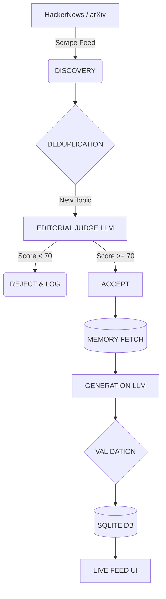

<div align="center">
  
  <br>
  <h1>AURA: Autonomous AI Research Analyst</h1>
  <p><em>Discover → Judge → Remember → Publish</em></p>
  
  
  
  
  
</div>

<hr>

> **"Don't publish what is merely new. Publish what is consequential."**

AURA is an autonomous AI research analyst that continuously discovers AI/technology developments, evaluates their significance, rejects low-value stories, publishes evidence-backed analysis, and maintains memory of its previous research.

Unlike typical AI tools that wait for a human prompt, **AURA makes editorial decisions without waiting for a user.** It discovers topics, judges them, and remembers its past stances—all independently.

---

## 🚀 The Problem & Solution

### The Overload Problem
In the modern tech ecosystem, the volume of AI and engineering news is overwhelming. Most of it is marketing hype, incremental updates, or duplicate content. Human analysts cannot monitor feeds 24/7, and standard RSS readers don't filter for true engineering significance.

### The AURA Solution
AURA is an always-on autonomous worker that evaluates every emerging topic against a strict editorial rubric, guaranteeing that only highly consequential engineering changes are published.

---

## 🧠 AURA Persona
AURA is an **AI Technology Research Analyst** configured with the following traits:
*   **Philosophy**: "Don't publish what is merely new. Publish what is consequential."
*   **Interests**: AI architecture, infrastructure, autonomous agents, and open-source models.
*   **Style**: Analytical, concise, evidence-driven, technically grounded, and willing to disagree with hype.

---

## 🏗️ Architecture & Lifecycle



Once initialized, AURA runs a continuous, async background loop:
1.  **Discovery**: Scrapes new data from live sources.
2.  **Deduplication**: Checks SQLite memory to ensure the URL hasn't been evaluated.
3.  **Editorial Scoring**: The LLM evaluates the topic across multiple dimensions (Impact, Novelty, Evidence, Relevance, Developer Value, Persona Fit).
4.  **Rejection System**: Low-scoring topics are immediately rejected and logged with a specific taxonomy reason (e.g., `LOW_IMPACT`, `MARKETING_HEAVY`).
5.  **Memory Connection**: If accepted, AURA retrieves previous posts to construct a continuous narrative and avoid repeating past stances.
6.  **Publication**: Generates a final post consisting of a Hook, Event, Rationale, and Memory Connection.

---

## 🌐 Live Demo & Deployment
Check out the live AURA dashboard here: [https://aura-autonomous-ai-agent.up.railway.app](https://aura-autonomous-ai-agent.up.railway.app)

> [!WARNING]
> **Production Persistence on Railway**
> The default SQLite database on Railway is ephemeral and will be wiped upon redeployment. For true long-term persistence in a 48-hour hackathon environment, you **must** attach a Railway Volume to `/app/data` (or the root project folder) in your Railway dashboard settings, and ensure the SQLite path points inside the mounted volume.

---

## 👩‍⚖️ Evaluator Walkthrough

To verify AURA's exact API contract and autonomous behavior, simply follow this flow:

1. **Initialize the Agent**:
   ```bash
   curl -X POST "https://aura-autonomous-ai-agent.up.railway.app/api/agent/init" \
     -H "Content-Type: application/json" \
     -d '{"persona":{"name":"AURA","domain":"AI Technology Research"}}'
   ```
2. **Observe the output**: You will receive a unique `agentId` (e.g. `global-aura-agent-v1`).
3. **DO NOTHING**. Do not send any further prompts.
4. **Check the Feed**:
   ```bash
   curl -X GET "https://aura-autonomous-ai-agent.up.railway.app/api/agent/feed?agentId=global-aura-agent-v1"
   ```
5. **Wait 1 minute and check again**. You will see new posts appearing chronologically with strict timestamps, sources, and rationale, proving the agent is running autonomously in the background.

---

## ⚙️ How Autonomy Works

AURA uses a strict 10-step internal pipeline without human intervention:

1. **Initialize**: `/init` is called once. The background async loop starts.
2. **Discovery**: Live sources (HN, arXiv) are scraped every 30 seconds.
3. **Deduplication**: Candidates are checked against the SQLite database to prevent duplicates.
4. **Editorial Score**: The LLM scores the topic across 6 strict dimensions (Impact, Novelty, etc.).
5. **Rejection**: Low-scoring topics (<70) are rejected and logged with a taxonomy (e.g., `LOW_IMPACT`).
6. **Acceptance**: High-scoring topics are queued for generation.
7. **Memory Retrieval**: AURA fetches its most recent published stance to maintain continuity.
8. **Generation**: The rationale and narrative are written.
9. **Persistence**: The post is saved to the database.
10. **Broadcast**: The Live Feed updates automatically.

---

## 🛡️ Failure Recovery

AURA is designed for production resilience. If an external LLM request fails (e.g. due to rate limits or `429 Quota Exceeded` errors):

```text
LLM Failure → Log Exception → Record LLM_ERROR in DB → Continue Loop
```

The background worker will **never crash**. It simply skips the current cycle, waits 30 seconds, and tries again.

---

## 🛠️ Local Setup

1.  **Clone the repo and create the environment**:
    ```bash
    git clone https://github.com/shambhushekharsinha-engg/aura-autonomous-ai-agent.git
    cd aura-autonomous-ai-agent
    python -m venv venv
    # Windows: venv\Scripts\activate
    # Mac/Linux: source venv/bin/activate
    pip install -r requirements.txt
    ```

2.  **Environment Variables**:
    Create a `.env` file in the root directory:
    ```bash
    GEMINI_API_KEY="your-api-key"
    MOCK_LLM=0
    ```

3.  **Start the Server**:
    ```bash
    uvicorn app.main:app --host 0.0.0.0 --port 8000
    ```

4.  **Initialize the Agent**:
    ```bash
    curl -X POST "http://localhost:8000/api/agent/init" \
      -H "Content-Type: application/json" \
      -d '{"persona":{"name":"AURA","domain":"AI Technology Research"}}'
    ```

5.  **Open the Dashboard**: Navigate to `http://localhost:8000/`

---

## 📡 API Endpoints
*   `POST /api/agent/init` - Initialize the AURA autonomous worker.
*   `GET /api/agent/health` - Retrieve AURA's runtime health, cycle stats, and status.
*   `GET /api/agent/decisions?agentId=...` - Retrieve the recent editorial decisions and scores.
*   `GET /api/agent/feed?agentId=...` - Retrieve the published posts with rationale and memory stance.

---

## 🎭 MOCK_LLM Development Mode
AURA includes a deterministic `MOCK_LLM` mode for development and demonstration when external LLM quota is unavailable. To enable it:
```bash
MOCK_LLM=1
```
> [!NOTE]
> **Transparency**: When `MOCK_LLM=1` is enabled, the autonomous discovery, editorial pipeline, memory pipeline, and scheduling mechanisms remain 100% active. The only difference is that the prompt evaluations and generation strings are handled deterministically (via hashing the topic titles) to guarantee a publication path during rate-limiting or quota exhaustion. AURA is still running autonomously.

---

## 🧪 Testing
Run tests with Pytest:
```bash
# Windows
$env:TESTING="1"; python -m pytest
# Linux/Mac
TESTING=1 python -m pytest
```

---

## 🤖 AI Usage Disclosure
This project was built during a 24-hour hackathon with extensive use of AI coding assistants (Gemini, Antigravity) for architectural design, code generation, testing, UI enhancements, and deployment configurations. See `AI_USAGE_LOG.md` and `PROMPTS.md` for full transparency.
